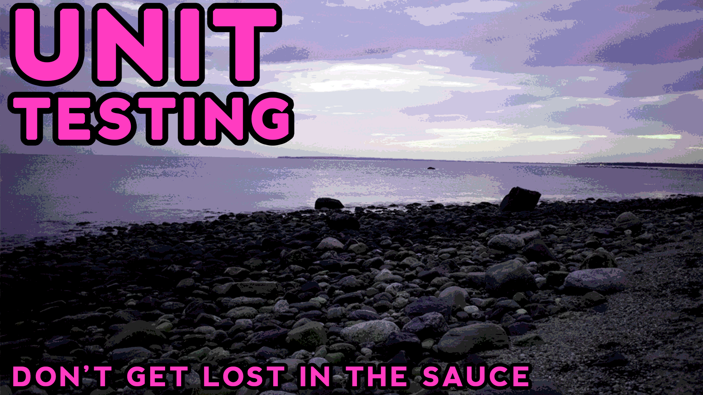

# Introduction to Unit Testing in MUnit
### Low level code doesn't have to mean untested code

This github shows off code explained in [this](https://blog.devgenius.io/introduction-to-unit-testing-in-munit-4ce7e24ff3f4) medium article!

If you'd like to know more about unit testing, low level programming, and more, be sure to check it out!

